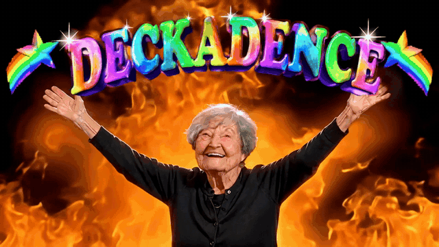

# Deckadence



**Deckadence helps you move slides between Google Slides, Figma and Keynote.** Choose the converter for your goal, then ask an AI assistant on your Mac to do the work. It rebuilds the slides, keeps text editable, and checks the result against the original.

You don't need to know how to code. Each converter has its own requirements. For example, Google Slides → Figma does not need Keynote.

## What it can do

| Converter | From | To | You also need |
|---|---|---|---|
| **Google Slides → Figma** | A Google Slides deck | Pages in a Figma file | A Figma account and Python |
| **Google Slides → Keynote** | A Google Slides deck | A Keynote file | Keynote |
| **Figma → Keynote** | Slide-sized frames in a Figma file | A Keynote file | Keynote and a Figma account |

Each converter is separate. Install only the ones you need.

For either Keynote converter, Keynote Creator Studio works best. Apple's standard Keynote also works if it's up to date.

## What you need

- **A Mac.**
- **An AI assistant that can work on your Mac.** Two work with Deckadence:
  - **Claude Code**, made by Anthropic;
  - **Codex**, made by OpenAI.

  Both have a desktop app. You type what you want in plain words, and the assistant does the work on your computer. If you don't have one yet, search for "Claude Code" or "Codex" and follow their setup steps.

Account and software needs depend on the converter you choose; see the table above.

## Step 1: Install the converter you want

Ask your AI assistant to install the converter that matches your goal. Copy the matching message and paste it into Claude Code or Codex:

- **Google Slides → Figma:** “Please install the Deckadence skill from https://github.com/evanbbb/deckadence/raw/main/skills/google-slides-to-figma.zip into my skills folder.”
- **Google Slides → Keynote:** “Please install the Deckadence skill from https://github.com/evanbbb/deckadence/raw/main/skills/google-slides-to-keynote.zip into my skills folder.”
- **Figma → Keynote:** “Please install the Deckadence skill from https://github.com/evanbbb/deckadence/raw/main/skills/figma-to-keynote.zip into my skills folder.”

When the assistant says it's done, **quit the assistant and open it again**, so it finds the new converter.

<details>
<summary><strong>Prefer to install it yourself?</strong> Follow these steps.</summary>

1. **Download** the converter you want. Click its link, and the file goes to your Downloads folder:
   - [Google Slides → Figma](https://github.com/evanbbb/deckadence/raw/main/skills/google-slides-to-figma.zip)
   - [Google Slides → Keynote](https://github.com/evanbbb/deckadence/raw/main/skills/google-slides-to-keynote.zip)
   - [Figma → Keynote](https://github.com/evanbbb/deckadence/raw/main/skills/figma-to-keynote.zip)
2. **Open the download.** In Finder, open Downloads and double-click the file. Your Mac turns it into a folder with the same name.
3. **Open your assistant's skills folder.** In Finder, choose **Go → Go to Folder…** and paste the address for your assistant:
   - Claude Code: `~/.claude/skills`
   - Codex: `~/.agents/skills`

   If Finder says the folder doesn't exist, go to the folder above it (`~/.claude` or `~/.agents`), and create a new folder called `skills` inside it.
4. **Move the folder** from step 2 into the skills folder.
5. **Quit your assistant and open it again.**

</details>

## Step 2: Convert a deck

Open your AI assistant and ask for what you want, in your own words. For example:

- *"Put my Google Slides deck into Figma."*
- *"Turn this Google Slides deck into a Keynote file: https://docs.google.com/presentation/d/…"*
- *"Make a Keynote deck from the frames on this Figma page: https://www.figma.com/design/…"*

The exact steps depend on the converter. The assistant asks a few short questions about your source and destination, checks fonts or colours with you when needed, builds the slides, and checks the result against the original. Keynote conversions start with a small sample; when moving several decks into Figma, it starts with one deck so you can review the result first.

### The first time only

- **For a Keynote conversion, your Mac asks for permission to control Keynote.** Click **OK**. Your assistant may ask for permission to control apps or open your browser as needed.
- **For Google Slides:** the assistant needs to see your deck in a browser where you're signed in to Google. It explains how when it gets there.
- **For Figma:** the assistant needs a connection to your Figma account. It walks you through it. You sign in to Figma in your browser once.

## What to expect

**What comes across**
- Text you can edit, in the original fonts, weights, italics and line breaks.
- Shapes, arrows and lines, as shapes you can edit.
- Images at full quality, cropped and shaped (circles, rounded corners) like the original.
- **When converting to Keynote:** animated GIFs play. YouTube videos become a picture that opens the video when clicked.

**What doesn't come across**
- Speaker notes.
- Links inside text (from Google Slides).
- Figma shadows, prototype links and animations.
- Charts and tables become simple shapes or pictures.
- **When converting to Figma:** GIFs need one drag from you to play. The assistant tells you which folder to drag in.

**Where your files go:** Keynote files are saved on your Mac. Google Slides → Figma creates pages in your Figma file and uploads slide images there. While it works, your AI assistant can see slide content and sends what it needs to the company that makes it, as it does for any task you give it.

## If something goes wrong

- **A Keynote conversion isn't responding.** Keynote may be showing a message. Read it to the assistant, or send it a screenshot, then click **OK**.
- **For a Keynote conversion, you clicked "Don't Allow" by mistake.** Open **System Settings → Privacy & Security → Automation**. Find your assistant or Terminal, and turn on **Keynote**. Then ask the assistant to try again.
- **The assistant doesn't know about the converter.** Quit the assistant and open it again. If that doesn't help, ask it to install the converter again (Step 1).
- **A slide doesn't look right.** Tell the assistant which slide and what's wrong. It can fix and rebuild just that slide.

---

## For people changing the converters

Everything technical lives in the [`source`](source) folder. The [`skills`](skills) folder holds the download files.

### Rules for anyone changing these skills (people and AI agents)

These skills must work in **both Codex and Claude Code** (and other AI coding tools that read `SKILL.md` folders). Before you finish any change, check it against these rules:

1. **No Claude-specific tooling in the skills.** Don't name or rely on tools only one AI tool has: no `AskUserQuestion`, no Claude-only browser tools as the only route, no slash commands, no Claude plugin skills as a requirement. Write "ask the user" (each skill explains how) and describe tools generically ("a browser tool that can run JavaScript in a page", "the Figma MCP server"). MCP servers are fine: both tools support them.
2. **Keep user files in the chosen destination.** Don't publish anything to claude.ai or send decks and results to unrelated services. Google Slides → Figma uploads slide images to the user's chosen Figma file; the Keynote converters save their output on the user's Mac.
3. **Nothing to install, no admin rights** (the Keynote skills). Scripts are JavaScript for Automation (`osascript -l JavaScript`) plus tools that ship with macOS. No Python, npm or Homebrew dependencies.
4. **Test in both tools.** Try each changed converter in Claude Code and Codex (`codex exec` in a folder with the skill under `.agents/skills/`), using a small pilot that fits that workflow. Codex's sandbox blocks controlling Keynote by default: Keynote skills must still get permission to do that, as `references/setup.md` explains.
5. **Test in small batches.** Use varied slides or frames, re-test affected ones after a fix, and ask before processing a full user deck.
6. **Keep this README readable for people who don't use GitHub or a terminal** (plain language, ISO 24495-1). Technical detail goes in this section or in `source/`.

### Layout

```
README.md                      this page
skills/                        the download files: one <skill>.zip per skill
source/
  google-slides-to-figma/      skill: Google Slides → Figma
  google-slides-to-keynote/    skill: Google Slides → Keynote
  figma-to-keynote/            skill: Figma → Keynote
  shared/
    google-slides/             the Google Slides reader (used by both Google Slides skills)
    keynote/                   the Keynote builder and checker (used by both Keynote skills)
  readme/                      pictures used on this page
  sync-shared.sh               copies shared/ into each skill that uses it
  package.sh                   syncs, then builds skills/<skill>.zip
```

- **Edit shared code in `source/shared/`, never in a skill's copy.** Each skill must work on its own once installed, so shared files are copied in, not linked. Run `sh source/sync-shared.sh` after editing (`--check` reports stale copies and exits 1).
- **After any change, run `sh source/package.sh` and commit `skills/` with it.** The download links on this page point at those files.
- The Keynote builder takes a neutral deck spec (`source/shared/keynote/deck-spec.md`). A new "… to Keynote" skill only needs a reader that writes that spec; building, italics, text alignment and checking come for free.
- Lessons learned: each skill's `references/gotchas.md`, plus `source/shared/keynote/keynote-gotchas.md` for Keynote.
- Install locations: Claude Code reads `~/.claude/skills` (or a project's `.claude/skills`); Codex reads `~/.agents/skills` (or a project's `.agents/skills`).

Not tracked in git (see `.gitignore`): slide images and GIFs (except `source/readme/`), browser session state (`.gstack/`, which holds sign-in cookies), deck extracts and working folders.
